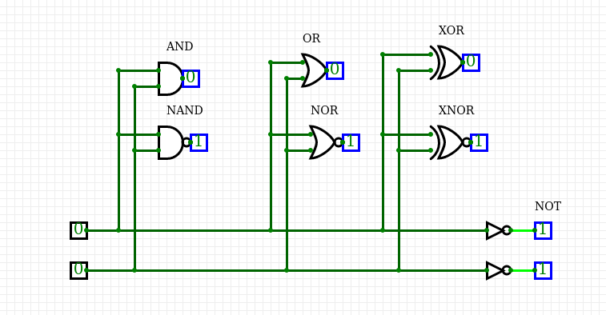
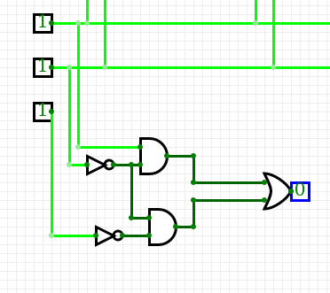
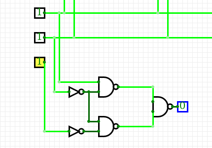
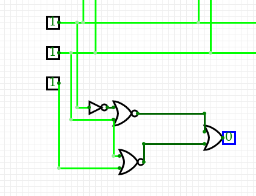

## Gates
| **A** | **NOT** |
| :-: | :-: |
| 0 | 1 |
| 1 | 0 |

| **A** | **B** | **AND** | **NAND** |
| :-: | :-: | :-: | :-: |
| 0 | 1 | 0 | 1 |
| 0 | 0 | 0 | 1 |
| 1 | 1 | 1 | 0 |
| 1 | 0 | 0 | 1 |

| **A** | **B** | **OR** | **NOR** |
| :-: | :-: | :-: | :-: |
| 0 | 1 | 1 | 0 |
| 0 | 0 | 0 | 1 |
| 1 | 1 | 1 | 0 |
| 1 | 0 | 1 | 0 |

| **A** | **B** | **XOR** | **XNOR** |
| :-: | :-: | :-: | :-: |
| 0 | 1 | 1 | 0 |
| 0 | 0 | 0 | 1 |
| 1 | 1 | 0 | 1 |
| 1 | 0 | 1 | 0 |

## De Morgan's law

| **A** | **B** | **C** |  |  |  |
| :-: | :-: | :-: | :-: | :-: | :-: |
| 0 | 0 | 0 | 1 | 1 | 1 |
| 0 | 0 | 1 | 0 | 0 | 0 |
| 0 | 1 | 0 | 0 | 0 | 0 |
| 0 | 1 | 1 | 0 | 0 | 0 |
| 1 | 0 | 0 | 1 | 1 | 1 |
| 1 | 0 | 1 | 1 | 1 | 1 |
| 1 | 1 | 0 | 0 | 0 | 0 |
| 1 | 1 | 1 | 0 | 0 | 0 |

 \
 \

|  |  |  |
| :-: | :-: | :-: |
