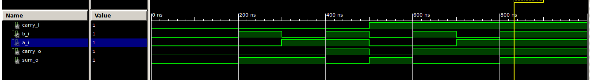

# Lab 04 - Adder

## Half adder

| **B** | **A** | **Carry** | **Sum** |
| :-: | :-: | :-: | :-: |
| 0 | 0 | 0 | 0 |
| 0 | 1 | 0 | 1 |
| 1 | 0 | 0 | 1 |
| 1 | 1 | 1 | 0 |

## Full adder

| **Cin** | **B** | **A** | **Cout** | **Sum** |
| :-: | :-: | :-: | :-: | :-: |
| 0 | 0 | 0 | 0 | 0 |
| 0 | 0 | 1 | 0 | 1 |
| 0 | 1 | 0 | 0 | 1 |
| 0 | 1 | 1 | 1 | 0 |
| 1 | 0 | 0 | 0 | 1 |
| 1 | 0 | 1 | 1 | 0 |
| 1 | 1 | 0 | 1 | 0 |
| 1 | 1 | 1 | 1 | 1 |

## Simulation result

