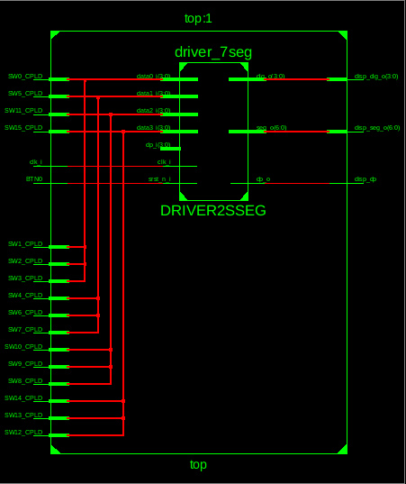
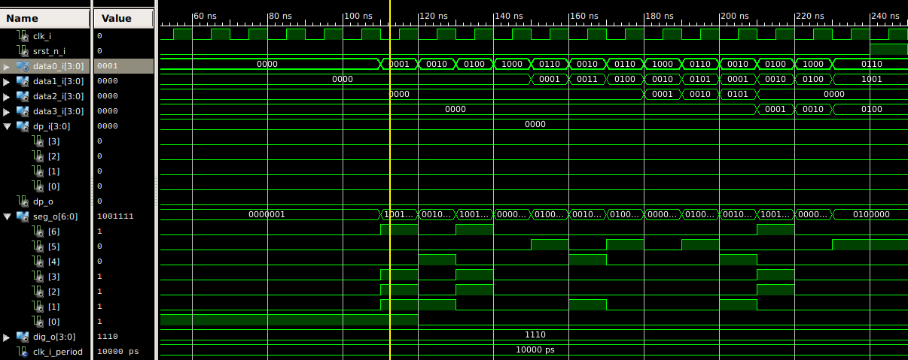
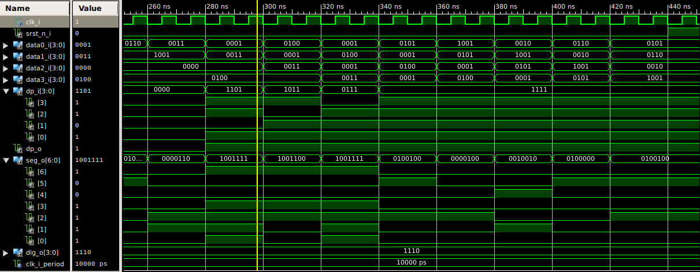

## Lab. 06 display driver
Updating reference VHDL files, to run the simulations of functional display driver(with decimal point).

### Preparation
Adding signal forms

```
{signal: [
  ['Digit position',
    {name: 'disp_dig_o(3)', wave: 'xx01..01..xx', },
    {name: 'disp_dig_o(2)', wave: 'xx101..01.xx', },
    {name: 'disp_dig_o(1)', wave: 'xx1.01..01xx', },
    {name: 'disp_dig_o(0)', wave: 'xx1..01..0xx', },
  ],
  ['Seven-segment data',
    {name: 'disp_seg_o',       wave: 'xx33335555xx', data: ['0','3','1','4','0','3','1','4'], },  
    {name: 'A: disp_seg_o(6)', wave: 'xx0.1.0.1.xx', },
    {name: 'B: disp_seg_o(5)', wave: 'xx0.......xx', },
    {name: 'C: disp_seg_o(4)', wave: 'xx0.......xx', },
    {name: 'D: disp_seg_o(3)', wave: 'xx0.1.0.1.xx', },
    {name: 'E: disp_seg_o(2)', wave: 'xx01..01..xx', },
    {name: 'F: disp_seg_o(1)', wave: 'xx01.0.1.0xx', },
    {name: 'G: disp_seg_o(0)', wave: 'xx10101010xx', },
  ],
  {name: 'Decimal point', wave: 'xx101..01.xx', },
],
  head: {
    text: '4ms   4ms   4ms   4ms   4ms   4ms   4ms   4ms',
  },
}
```


### RTL model of finished project


### First simulation of working driver without decimal point, displaying square roots of 2


### Second simulation of working driver with decimal point, displaying PI number(3.14159265) in sequence



