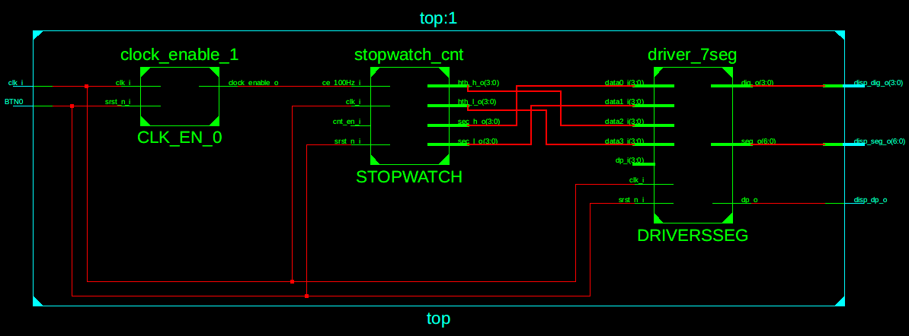
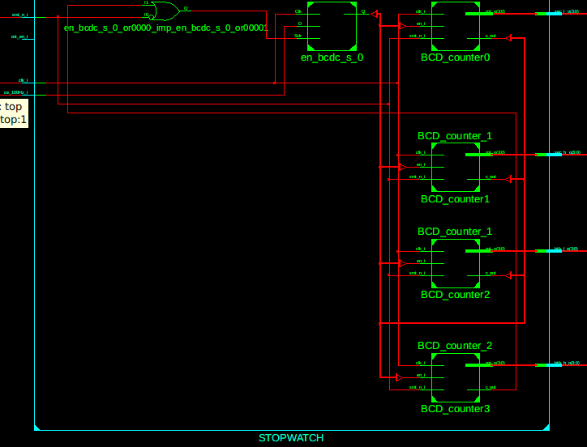
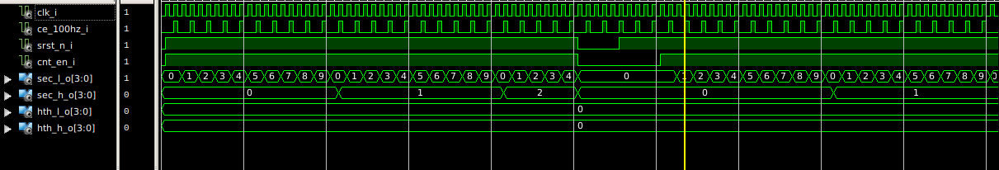
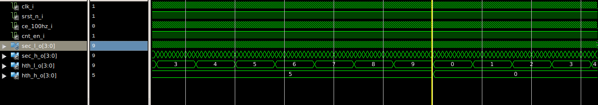

## Lab 07 - Stopwatch
Stopwatch based on BCD counters.
So far the hardest task(approx. 12hrs of work, for comparison lab06 - 2hrs).

### RTL top schematic

### RTL stopwatch schematic

### Simulation of stopwatch functionality with explicit reset

### Simulation of automatic reset on 59:99

