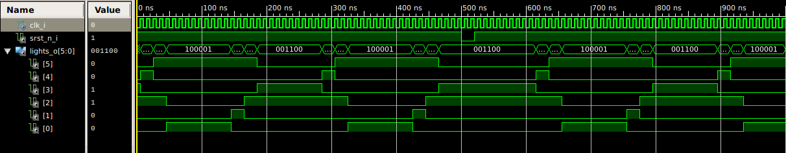

## Task 08 - Traffic light

### Example of definition of new data type
```
	type state_type is (state1,state2,state3);
	signal state:	state_type;
```
### State diagram


### Simulation of traffic lights controller(20ns=1s)



