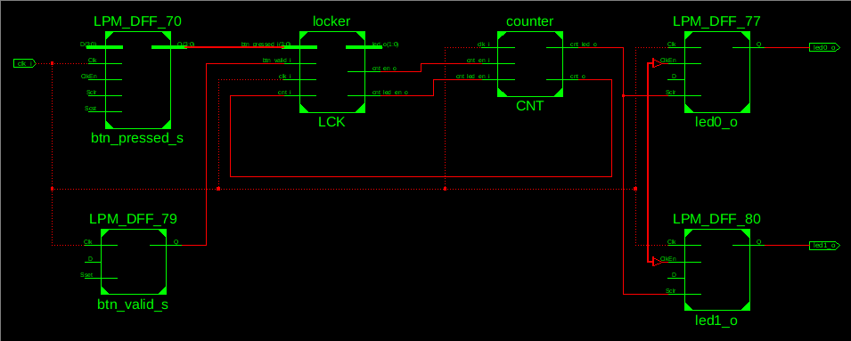
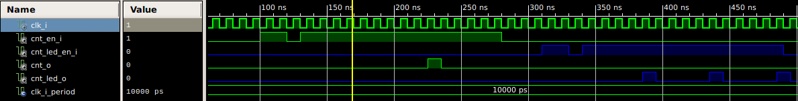
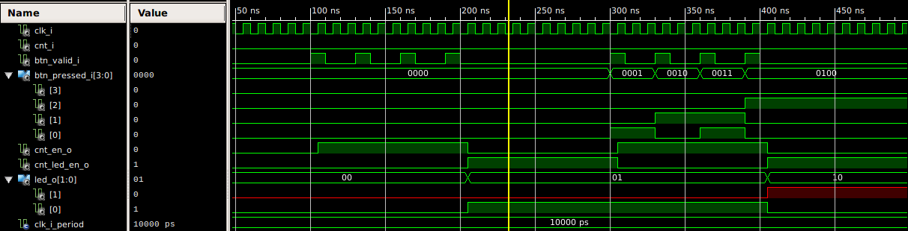
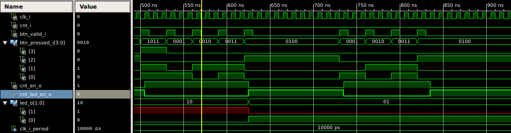
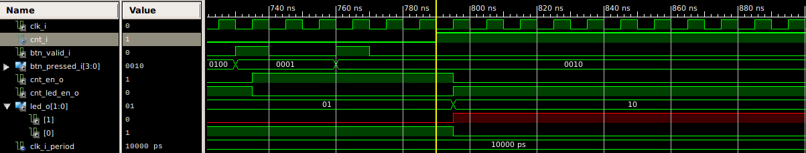
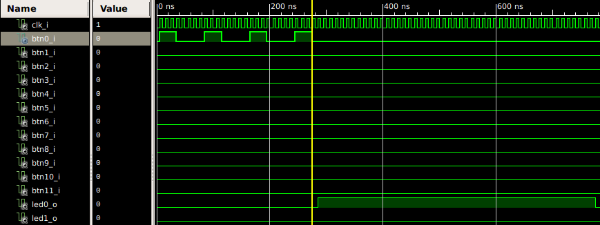
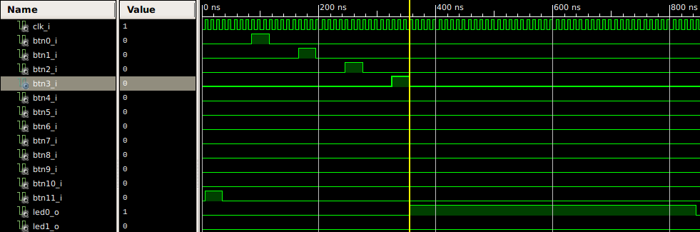
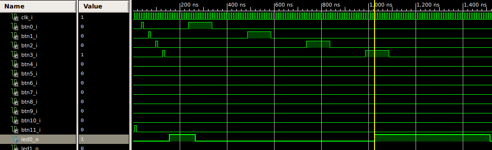

# Kódový zámok
## Digitálna elektronika 1 -  Projekt

### Zadanie
Kódový zámek s maticovou klávesnicí 4x3, časovým limitem pro zadání správného pinu a signalizací chybného pokusu.  

### Rozbor zadania
Kódový zámok bude predstavovať FSM automat ako hlavný riadiaci proces.  
Maticová klávesnica je v prípade expanznej CPLD dosky v podobe tlačidiel(veľkosti 4x3).  
Časový limit pre zadanie správneho PINu je realizovateľné pomocou čítača s určenou maximálnou hodnotou.  
Signalizácia chybného pokusu pomocou červenej LED diódy.  

####  Rozšírenie
Možnosť zmeny PIN kódu za behu programu relaizovateľná pomocou logických vektorov.  
Signalizácia správneho zadania PIN kódu pomocou zelenej LED diódy.  

#####  Možné ďalšie neimplementované rozšírenia:
<small>Prepojenie s displejom pre zobrazovanie  skrytého \****  PIN kódu.  
Možnosť zmazania znaku pri zadávaní PIN kódu.  </small>

### Implementácia
Projekt je rozdelený do troch modulov (entít)
- counter
- locker
- top

Modul [counter](code_lock/counter.vhd "Otvoriť code_lock/counter.vhd") - čítač obsahuje dva procesy
- *counter* - čítač používaný ako časový limit pre zadanie PIN kódu
- *counter_led* - čítač určujúci trvanie LED signalizácie

Modul [locker](code_lock/locker.vhd "Otvoriť code_lock/locker.vhd") - zámok  sprostredkuje proces stavového automatu.
  
Modul [top](code_lock/top.vhd "Otvoriť code_lock/top.vhd") zabezpečuje spracvanie vstupných a výstupných signálov ako aj rozhranie entitám *counter* a *locker*. Obsahuje

-  *btn_decoder* - dekóder vstupu

	&nbsp; &nbsp; &nbsp; dekóduje stlačenie tlačidla ako nábežnú hranu signálu a ukladá do 4-bitového vektoru informáciu o stlačenom tlačidle
-  *led_decoder* - dekóder na výstupe

	&nbsp; &nbsp; &nbsp; dekóduje vektor s informáciou o aktivácii LED diódy na výstupné signály

#### RTL schéma
> Zjednodušená schéma top modulu

Úplná schéma [TU](RTL_full.pdf)

### Simulácie
#### Modul **counter**
> [testbench](/code_lock/counter_tb_00.vhd) nulovanie čítača po deaktivácii signálu *_en_i , impulz na výstupe, po dosiahnutí MAX hodnoty čítača

#### Modul **locker** 
> [testbench](/code_lock/locker_tb_00.vhd) signalizácia spustenia čítača po stlačení tlačidla, LED(zelená/červená) signalizácia úspešnosti na výstup

> nastavenie nového PINu a testovanie jeho správnosti

> LED signalizácia po vypršaní času na zadanie PINu

#### Modul **top** 
> [testbench](/code_lock/top_tb_00.vhd) zadanie predvoleného PINu 0000 a následná LED(zelená) signalizácia na výstupe

> zadanie nesprávneho PINu 1234 a následná LED(červená) signalizácia na výstupe

> nastavenie nového PINu 1234  a následná LED(zelená) signalizácia na výstupe

> zadanie nového PINu 1234 a následná LED(zelená) signalizácia na výstupe

### Záver
Projekt *Kódový zámok* bol zrealizovaný ako ukážka nadobudnutých poznatkov z jazyka VHDL obsiahnutého v predmete *Digitálna elektronika 1*. Jednoduché zadanie projektu dovolilo úlohu rozvinúť podľa uváženia študentov a tak vytvoriť vlastné unikátne riešenie.

#### Referencie
- Santa, Kremiec, github repozitár [link](https://github.com/komplike/Digital-electronics-1/)
- Frýza T., github repozitár [link](https://github.com/tomas-fryza/Digital-electronics-1)
- Kubíček M., Vybrané partie jazyka VHDL [link](https://moodle.vutbr.cz/pluginfile.php/183804/mod_resource/content/1/vhdl_kubicek.pdf)
- Dr. Jayram, VHDL Reference Manual [link](https://www.ics.uci.edu/~jmoorkan/vhdlref/Synario%20VHDL%20Manual.pdf)

###### @April 2020
